# 🎟️ Event Management System

A full-stack **Event Management System** built with **Python, Django, Bootstrap 5, JavaScript, and SQLite**.

The application provides separate functionality for **administrators and regular users** to manage events, categories, registrations, attendees, wishlists, notifications, ticket verification, and event check-ins through a responsive web interface.

The project also includes an **AI-powered chatbot integrated with the Google Gemini API** for interactive event-related assistance.

---

## ✨ Features

### 👨‍💼 Admin Features

* Secure admin authentication
* Admin dashboard with event statistics
* Create, edit, and delete events
* Event category management
* Event member and attendee management
* Event status and priority management
* Event notifications
* Ticket and attendee management
* QR-based ticket scanning and verification
* Event check-in tracking with check-in time
* Financial management and reporting
* Responsive admin dashboard
* Customizable navbar and sidebar themes

### 👤 User Features

* User registration and login
* User logout
* User profile management
* Browse available events
* View event details
* Register for events
* View registered events
* Add events to wishlist
* Ticket-related functionality
* Event participation and check-in support
* Change password
* Forgot password and password reset functionality

### 🤖 AI Chatbot

The application includes an AI-powered chatbot integrated with the **Google Gemini API**.

The chatbot provides an interactive way for users to ask questions and receive event-related assistance.

The Gemini API key is configured through an environment variable and is **not stored directly in the source code**.

---

## 🛠️ Tech Stack

| Technology            | Purpose                                    |
| --------------------- | ------------------------------------------ |
| **Python**            | Backend programming                        |
| **Django**            | Web framework and application architecture |
| **SQLite**            | Development database                       |
| **HTML5**             | Page structure                             |
| **CSS3**              | Custom styling                             |
| **JavaScript**        | Client-side functionality                  |
| **Bootstrap 5**       | Responsive user interface                  |
| **Crispy Forms**      | Django form rendering                      |
| **Pillow**            | Image processing                           |
| **Google Gemini API** | AI chatbot functionality                   |
| **Git & GitHub**      | Version control                            |

---

## 🏗️ Project Architecture

The application follows the **Django MVT (Model-View-Template)** architecture.

```text
Event-Management-System/
│
├── chatbot/
│   ├── views.py
│   └── ...
│
├── event_management/
│   ├── settings.py
│   ├── urls.py
│   ├── wsgi.py
│   └── ...
│
├── events/
│   ├── migrations/
│   ├── templates/
│   ├── models.py
│   ├── forms.py
│   ├── views.py
│   ├── urls.py
│   └── ...
│
├── static/
│   ├── css/
│   ├── js/
│   └── images/
│
├── templates/
│   ├── base/
│   └── ...
│
├── manage.py
├── requirements.txt
├── .gitignore
├── LICENSE
└── README.md
```

### Application Flow

```text
Administrator
     │
     ├── Manage Categories
     ├── Create & Manage Events
     ├── Manage Members
     ├── Manage Notifications
     └── View Reports
     
User
     │
     ├── Browse Events
     ├── View Event Details
     ├── Register for Events
     ├── Manage Wishlist
     └── Access Ticket / Check-in Features
```

---

## 🔐 Authentication & Authorization

The application provides different functionality based on the user's role.

### Authentication

* User registration
* User login and logout
* Password change
* Forgot password
* Password reset functionality
* User profile management

### Authorization

Administrators and regular users have separate application areas and permissions.

Administrators can access management functionality such as event creation, category management, member management, notifications, and reports, while regular users access event browsing and participation features.

---

## 🎟️ Event & Ticket Management

The system supports an event participation workflow from event creation to ticket verification and check-in.

```text
Create Event
     ↓
Manage Event
     ↓
User Browses Event
     ↓
User Registration
     ↓
Attendee Management
     ↓
Ticket Verification
     ↓
Event Check-in
```

Administrators can manage event attendees and verify tickets using the ticket verification functionality.

The system also maintains check-in information, including the check-in time.

---

## 🤖 Gemini AI Configuration

The chatbot uses the **Google Gemini API**.

For security, the API key should be stored in an environment variable instead of being hard-coded in the source code.

Create a `.env` file in the project root:

```env
GEMINI_API_KEY=your_api_key_here
```

Make sure `.env` is not committed to GitHub.

The project uses `.gitignore` to exclude environment-specific secrets from version control.

---

## 🚀 Installation & Setup

### 1. Clone the Repository

```bash
git clone https://github.com/Gunjanyadav6395/Event-Management-System.git
```

### 2. Navigate to the Project Directory

```bash
cd Event-Management-System
```

### 3. Create a Virtual Environment

```bash
python -m venv env
```

### 4. Activate the Virtual Environment

#### Windows PowerShell

```powershell
.\env\Scripts\Activate.ps1
```

#### Windows Command Prompt

```cmd
env\Scripts\activate
```

### 5. Install Dependencies

```bash
pip install -r requirements.txt
```

### 6. Configure Environment Variables

Create a `.env` file in the project root:

```env
GEMINI_API_KEY=your_api_key_here
```

### 7. Apply Database Migrations

```bash
python manage.py migrate
```

### 8. Create an Admin/Superuser

```bash
python manage.py createsuperuser
```

Follow the instructions displayed in the terminal.

### 9. Start the Development Server

```bash
python manage.py runserver
```

Open the application in your browser:

```text
http://127.0.0.1:8000/
```

---

## 🗄️ Database

The project currently uses **SQLite** as its development database.

Django database migrations are maintained inside the application's `migrations` directory.

The SQLite database file is excluded from version control through `.gitignore`.

For production deployment, the application can be configured with a production database such as **PostgreSQL**.

---

## 📁 Important Django Components

| Component     | Responsibility                         |
| ------------- | -------------------------------------- |
| `models.py`   | Database models and relationships      |
| `forms.py`    | Django forms and validation            |
| `views.py`    | Application logic and request handling |
| `urls.py`     | URL routing                            |
| `templates/`  | HTML user interface                    |
| `static/`     | CSS, JavaScript, and static assets     |
| `migrations/` | Database schema migrations             |
| `settings.py` | Django project configuration           |
| `chatbot/`    | Gemini-powered chatbot functionality   |

---

## 📸 Screenshots

### 🏠 User Interface

| Home Page                          | Login                                |
| ---------------------------------- | ------------------------------------ |
| 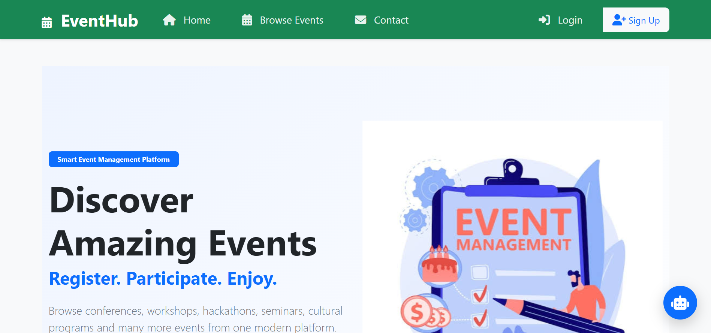 | 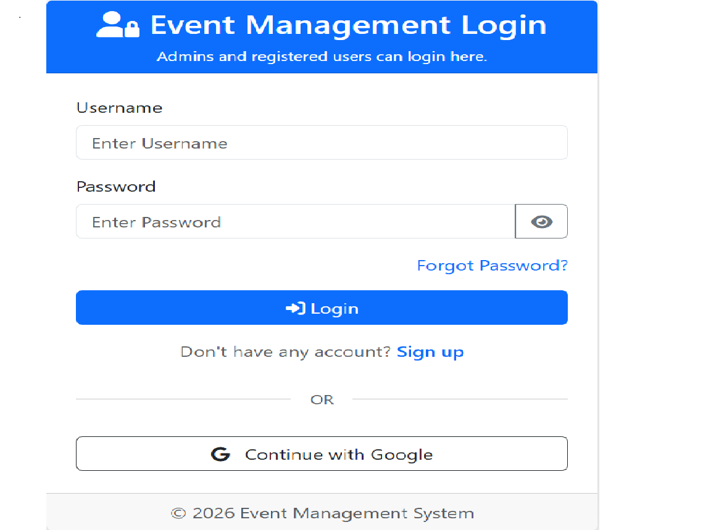 |

| Sign Up                             | Registered Events                                     |
| ----------------------------------- | ----------------------------------------------------- |
| 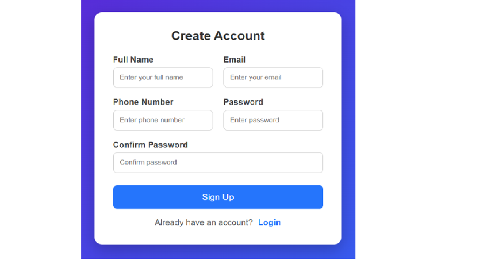 | 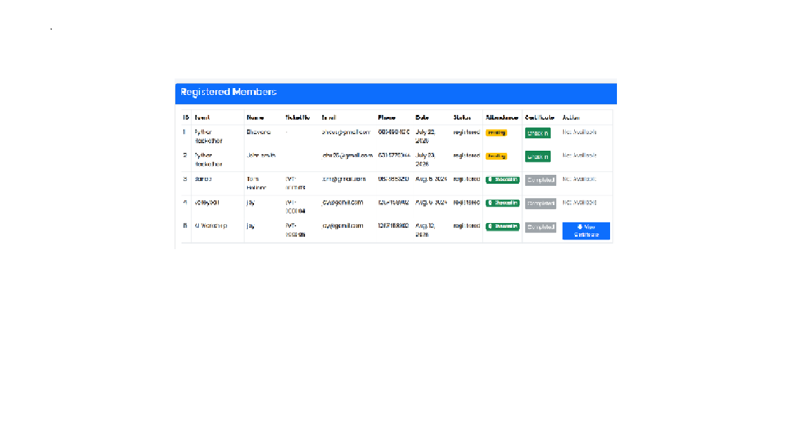 |

### ⚙️ Admin Dashboard & Management

| Dashboard                                     | Manage Events                                   |
| --------------------------------------------- | ----------------------------------------------- |
| 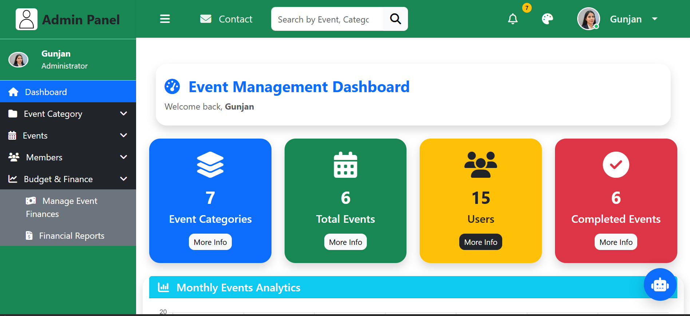 | 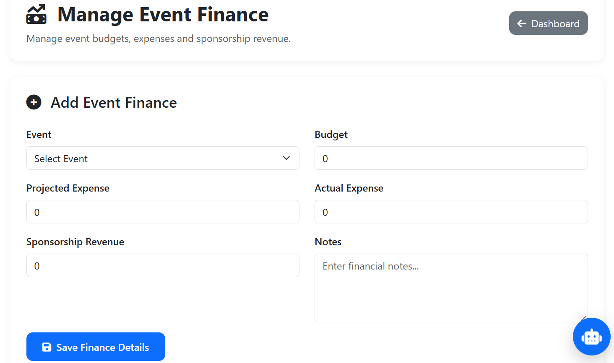 |

| Category List                                   | Create Category                                     |
| ----------------------------------------------- | --------------------------------------------------- |
| 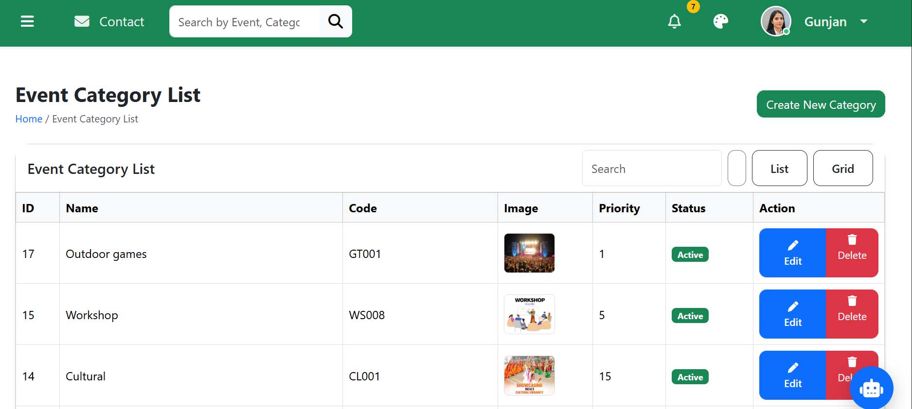 | 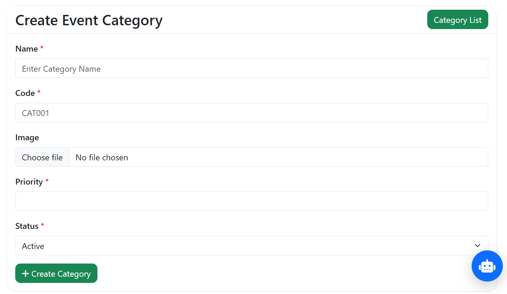 |

| Member List                                 | Add Member                                |
| ------------------------------------------- | ----------------------------------------- |
| 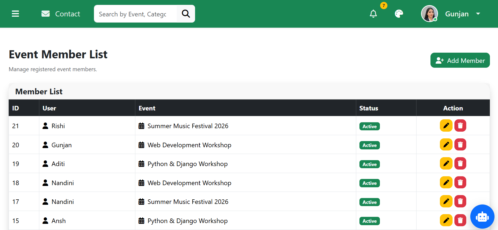 | 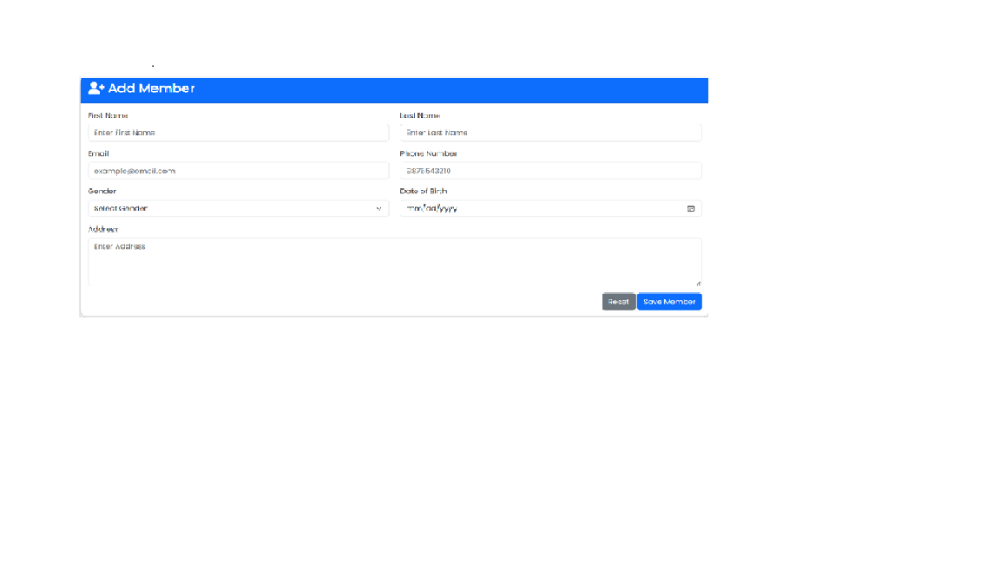 |

| Notifications                            | Reports                            |
| ---------------------------------------- | ---------------------------------- |
| 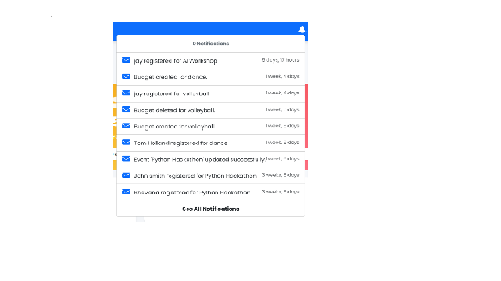 | 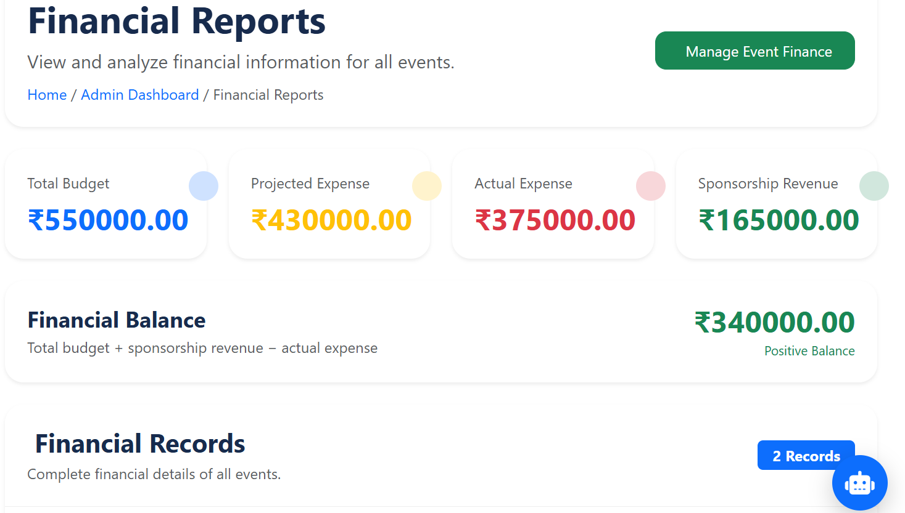 |

### 🎟️ Ticket Verification

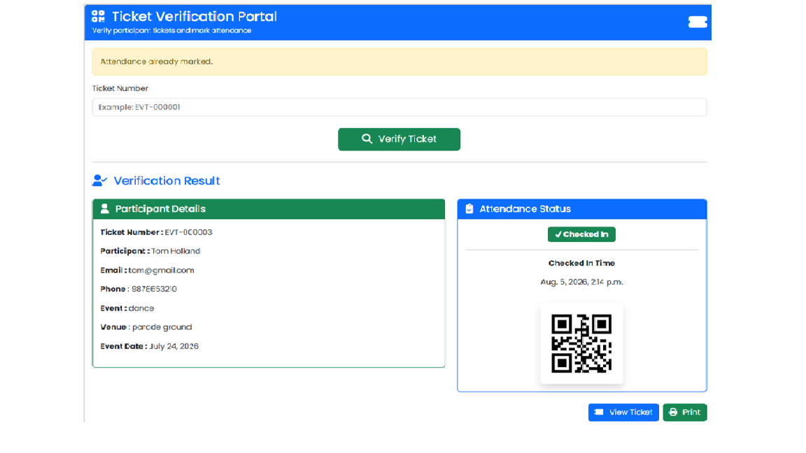

---

## 🔒 Security & Configuration

* API credentials are stored using environment variables.
* `.env` is excluded from Git version control.
* Django authentication is used for user access control.
* Role-based access separates administrator and regular-user functionality.
* Database migrations are managed through Django's migration system.

---

## 🚧 Future Enhancements

Possible future improvements include:

* Production deployment
* PostgreSQL database integration
* Downloadable PDF tickets
* Enhanced event analytics
* Email notifications and reminders
* Multiple event organizer support
* Advanced search and filtering
* Additional payment integration
* Improved mobile responsiveness

---

## 📚 Learning Outcomes

This project provided practical experience with:

* Django MVT architecture
* Python web development
* Database modelling and migrations
* Django authentication and authorization
* CRUD operations
* Form handling and validation
* Responsive UI development with Bootstrap
* JavaScript-based client-side functionality
* API integration
* Environment-variable based configuration
* Git and GitHub version control
* Building and documenting a complete web application

---

## 📄 License

This project is licensed under the **MIT License**.

See the [LICENSE](LICENSE) file for details.

---

## 👩‍💻 Author

**Gunjan Yadav**

MCA Graduate | Python & Django Developer

GitHub: [Gunjanyadav6395](https://github.com/Gunjanyadav6395)

---

⭐ If you find this project useful, consider giving it a star on GitHub.
